Apartments prices analysis
---

This project analyzes the Ukrainian real estate market, with a focus on apartments.  
A custom parser was developed to collect data from the online platform [lun.ua](https://lun.ua/).  
The collected data was then cleaned, transformed, and analyzed using Python libraries, SQL, and Excel 
to uncover trends and insights in the housing market.  
---
## Parser

To collect apartment data, a custom parser was developed.  
For each flat, it extracts the following information:

- Number of rooms  
- Total area  
- Living area  
- Kitchen area  
- Floor (in Ukraine, numbering starts from 1)  
- Total number of floors in the building  
- Year of construction  
- Price (in USD, calculated as price per square meter × area)  

If any field is missing, the parser returns an object with zeros.  
This approach simplifies further data cleaning.  

### Usage
To use the parser, provide a URL from [lun.ua](https://lun.ua/) with apartment listings and specify a filename for the output CSV. For example:

```python
def get_all_apartments() -> None:
    with webdriver.Chrome() as driver:
        set_driver(driver)
        write_apartment_to_csv(
            get_apartments("https://lun.ua/sale/odesa/flats"),
            "Odesa.csv"
        )
```

Sample output data: 
```python
{
    "num_of_rooms": 2,
    "area": 80,
    "living_area": 60,
    "kitchen_area": 10,
    "floor": 5,
    "floors_in_house": 9,
    "year_of_building": 2010,
    "price": 130000
}
```
---

## Analysis

First, apartment data from each regional center (e.g., Lviv, Rivne, Mykolaiv)  
was merged into a single CSV file, **`Ukraine.csv`**, with two additional fields:  
`city` and `region`.  

The dataset covers 5 regions of Ukraine:
- West  
- East  
- North  
- South  
- Center  

During the plotting stage, several new fields were added to enrich the analysis:

- `old_building` — indicates whether the house is considered old (built before 2001).  
- `close_to_borders` — shows if the region is located near Ukraine’s national borders.  
- `close_to_BL` — shows if the region is close to Belarus.  
- `popular_tourist_city` — marks whether the city is a popular tourist destination.  
- `is_big_city` — indicates whether the city is considered large.  
- `floor_class` — categorizes the apartment floor into three groups:  
  - **lower**: below 4th floor  
  - **mid**: 4th to 7th floor  
  - **upper**: above 7th floor

### Plots

### Question 1: Are flats in older buildings cheaper?

To investigate this, two plots were created:
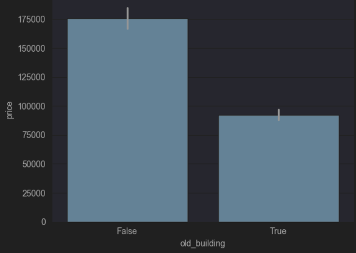
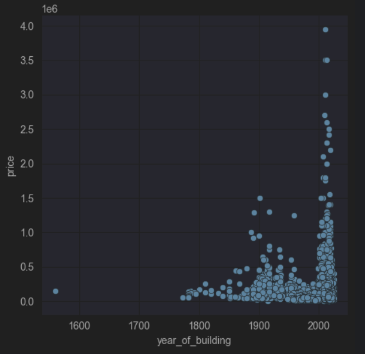

1. **Average price by building age** — comparing old buildings (built before 2001) vs. newer ones.  
2. **Scatter plot of price vs. year of construction** — showing how apartment prices are distributed across different 
building years.  

The results clearly indicate that apartments in older buildings tend to be significantly
cheaper than those in newer buildings.

### Question 2: Are new flats tend to be bigger?

Two more plots were created: 
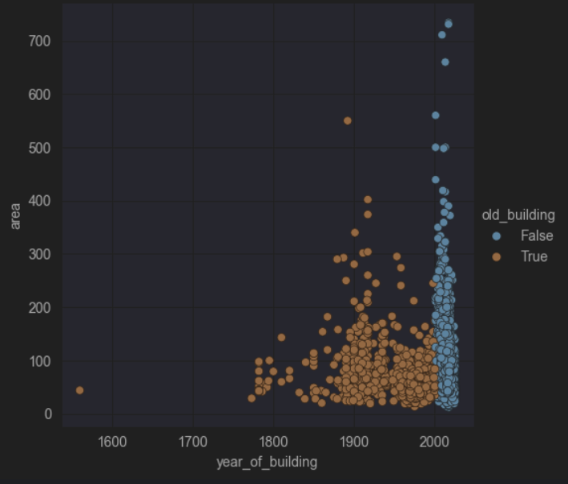
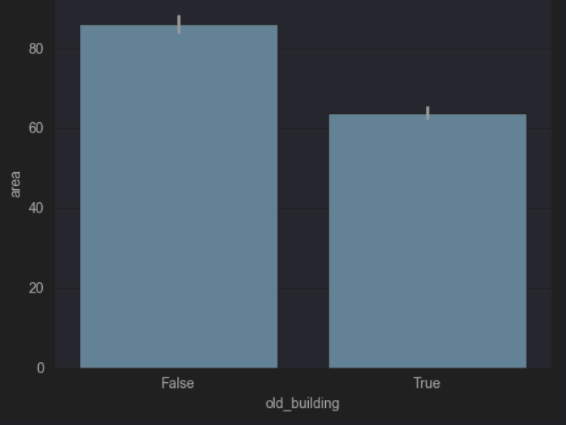

1. **Scatter plot of area vs. year of construction (colored by old_building)** - showing how apartment area are distributed 
across different building years.
2. **Average area by building age** - comparing old buildings vs. newer ones.

The results show that newer flats tend to have a larger average area.  
However, the scatter plot also reveals that during the early 1900s, some exceptionally large apartments were built, 
even compared to modern standards.

### Question 3: Are flats in relatively safe west part of Ukraine more expensive?

To give an answer two plots were made:
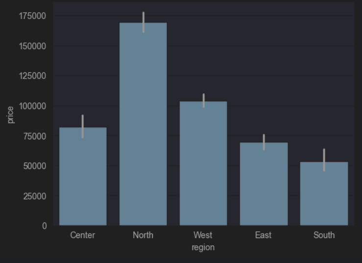
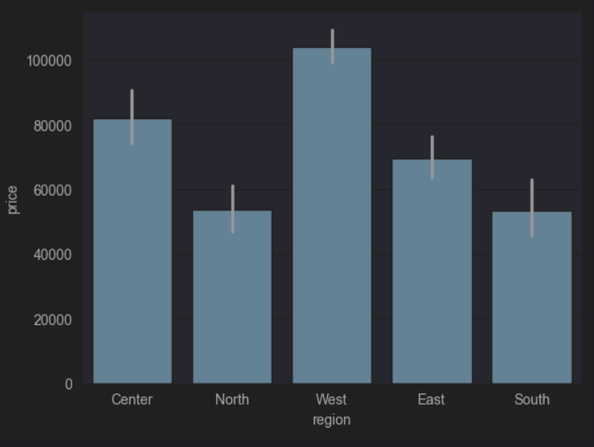

1. **Average price by region** — comparing prices across all regions.  
2. **Average price by region (excluding Kyiv)** — recalculated to remove the strong influence of the capital.  

The results show that when Kyiv is included, the North region has the highest prices.  
However, once Kyiv is excluded, the West region becomes the most expensive on average.

### Question 4: Are flats in Lviv, as 'capital of the West', more expensive than in Kyiv?

To find out, a bar plot was created:
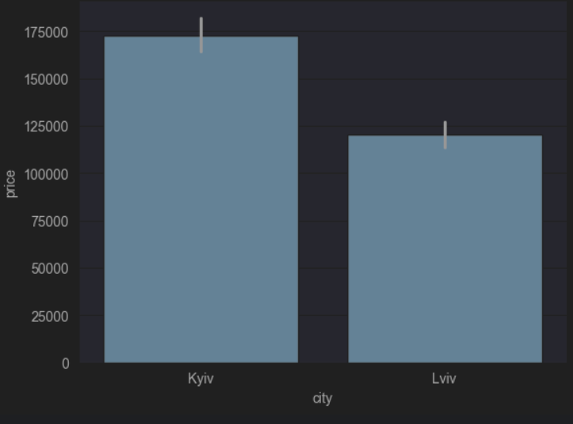

**Average price by city** - comparing apartment prices between Lviv and Kyiv.

The results show that, regardless of security situation, Kyiv remains the most expensive city of Ukraine.

### Question 5: Are flats in cities that are closer to border more expensive?

To investigate this, three plots were made:
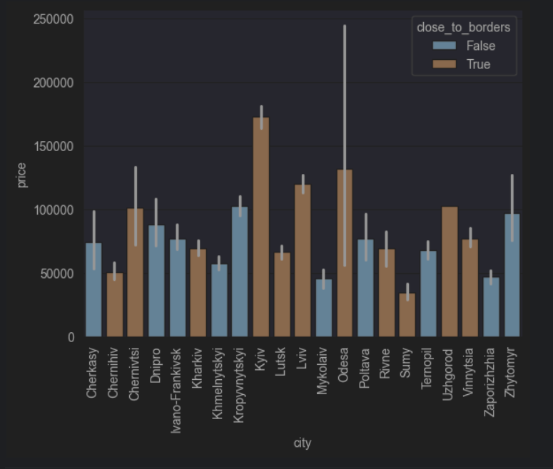
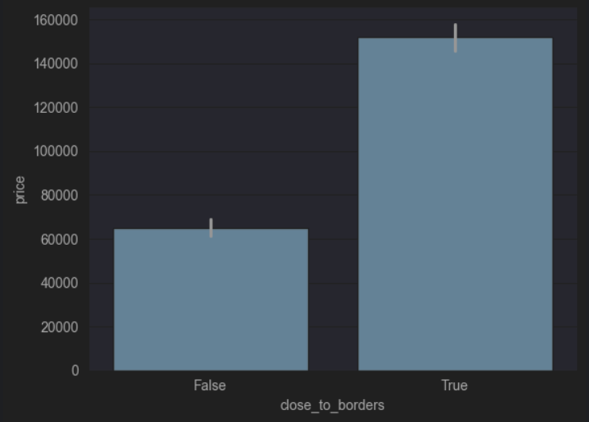
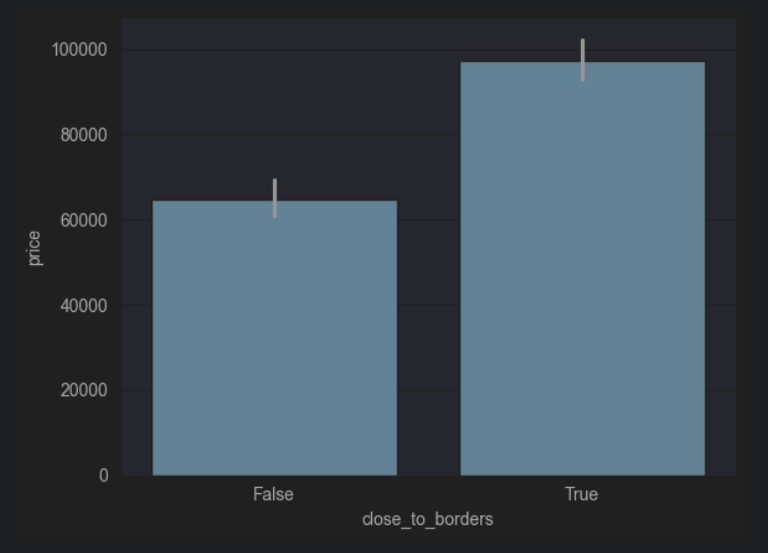

1. **Average price by city (colored by close_to_borders)** — comparing prices across all regional centers.  
2. **Average price by proximity to borders** — comparing cities close to the borders vs. those farther away.  
3. **Average price by proximity to borders (excluding Kyiv)** — recalculated to remove the strong influence of the capital.  

The results show that cities located closer to the borders tend to be more expensive on average.  
Even when Kyiv is excluded, this pattern remains unchanged.

### Question 6: Are flats in cities that are close to Belarus cheaper?

To investigate this, two plots were made:
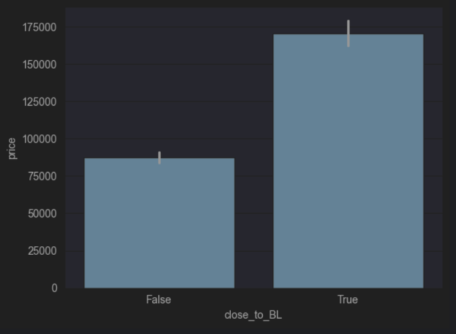
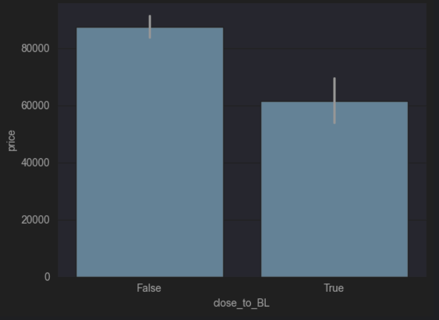

1. **Average price by proximity to Belarus** - comparing prices in cities close to Belarus vs. those farther away.
2. **Average price by proximity to Belarus (excluding Kyiv)** - recalculated to remove the strong influence of the capital.

The results show that cities located closer to Belarus tend to be cheaper on average,  
and this pattern becomes clearer once Kyiv is excluded.

### Question 7: Are flats in cities that are close to popular tourist places more expensive?

To investigate this, three plots were made:
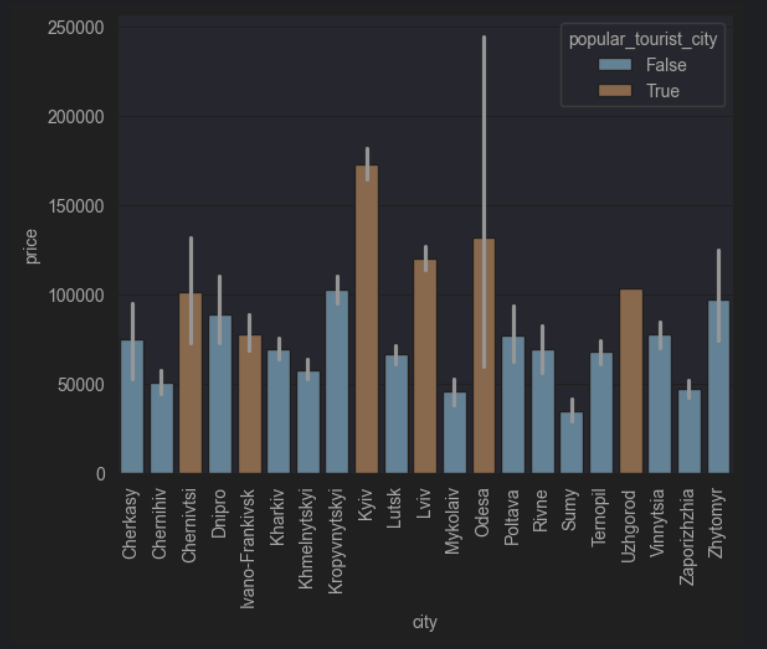
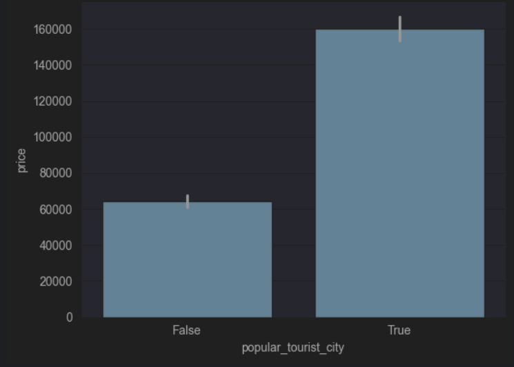
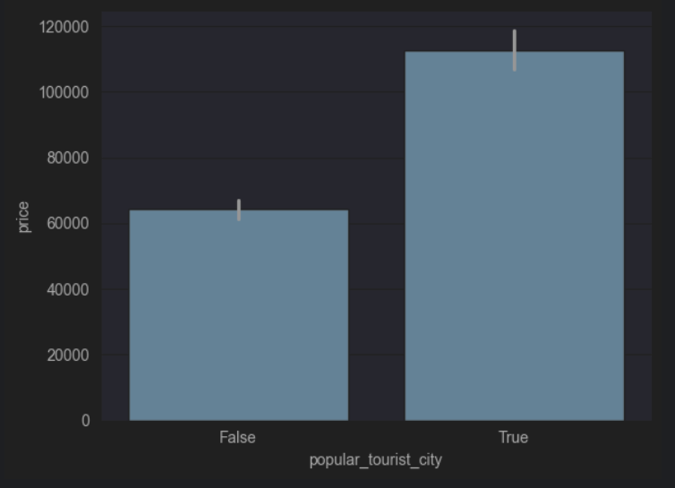

1. **Average price by city (colored by popular_tourist_city)** - comparing prices in cities close to popular tourist 
places vs. those farther away.
2. **Average price by proximity to popular tourist places** - comparing close to popular tourist places vs. those 
farther away.
3. **Average price by proximity to popular tourist places (excluding Kyiv)** - recalculated to remove the strong 
influence of the capital.

The results show that cities located closer to the popular tourist places tend to be more expensive on average.  
This trend persists even when Kyiv is excluded, showing that proximity to tourist hotspots is generally associated 
with more expensive flats.

### Question 8: Are flats in big cities more expensive?

To investigate this, two plots were made:
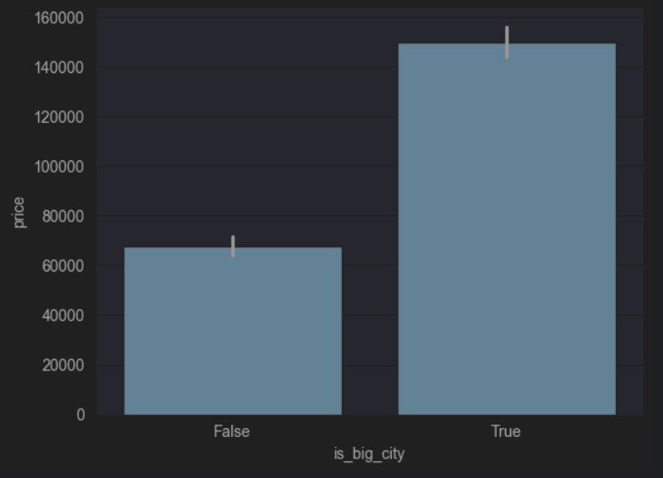
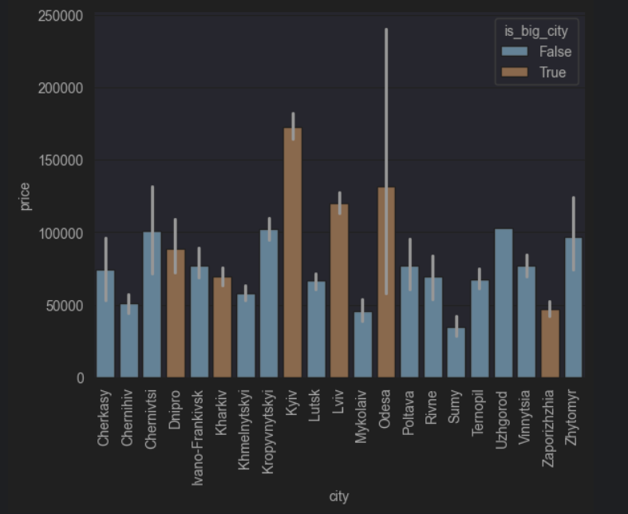

1. **Average price by big city** - comparing prices in big vs. small cities.
2. **Average price by city (colored by is_big_city)** - comparing prices across cities.

The results show that flats in big cities tend to be more expensive on average.

### Question 9: Are prices depend on which floor are flats?

To investigate this, scatter plot was made:
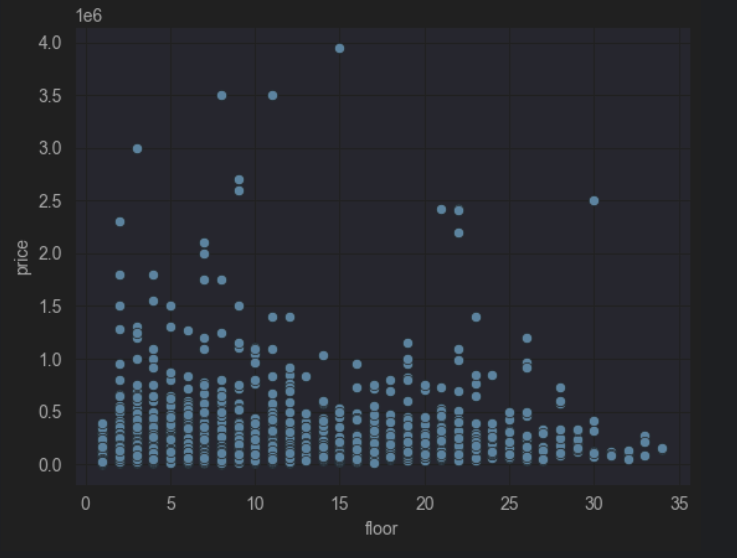

**Scatter plot of price vs. floor** - comparing prices across different floors

The results show that there are no clear correlation between price and floor.

### Question 10: Are flats on lower floors cheaper? 

To investigate this, bar plot was made:
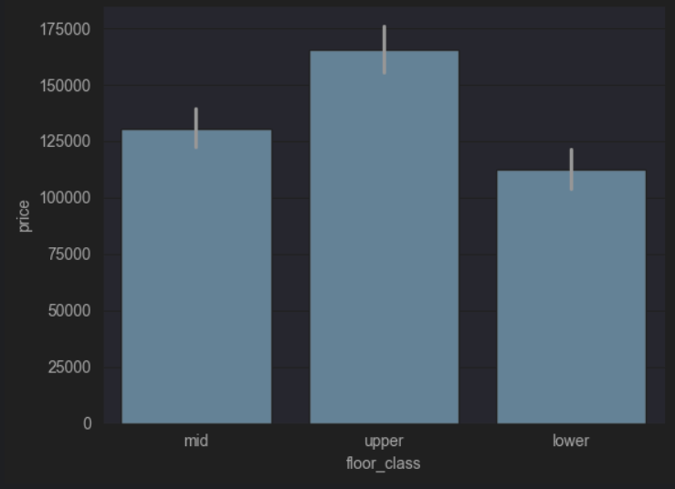

**Average price by floor class** - comparing prices across different floor classes.

The results show that apartments on lower floor class tend to be cheaper.

---
## Prediction model

The prediction model was created using the `sklearn` library.  

- **Data preprocessing:** Categorical values (`True`/`False`) were converted to `1`/`0`, and additional columns were 
added to indicate apartment regions.  
- **Model selection:** `RandomForestRegressor` and `KNeighborsRegressor` were tested. The best results were obtained 
with a `RandomForestRegressor` using 400 estimators.  

**Performance:** The model achieved a coefficient of determination (R²) of 53.54%, indicating that features 
such as number of rooms, total area, living area, kitchen area, floor, total number of floors, year of construction, 
big city status, and region explain over 50% of the variation in apartment prices.

---

## Conclusion

- Older buildings are generally cheaper than newer ones.  
- Newer flats tend to be larger in area.  
- Proximity to tourist destinations or borders, as well as being in a big city, increases average prices.  
- Floor alone does not strongly affect price, though lower floors tend to be slightly cheaper.  
- A Random Forest model can predict apartment prices moderately well, explaining over 50% of price variation.

---

# Working with Excel and SQL

## Excel Analysis

To analyze the influence of key features on apartment price, 50 random flats were selected. The following features were included:

- Number of rooms  
- Floor  
- Total number of floors  
- Year of construction  
- Region (represented numerically from 0 to 4):
  - 0: North
  - 1: East
  - 2: West
  - 3: South
  - 4: Center

Using the `LINEST` function in Excel, the regression model was calculated:  
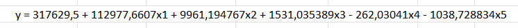  

Where:  
- x1: Number of rooms  
- x2: Floor  
- x3: Total number of floors  
- x4: Year of construction  
- x5: Region  

The resulting calculations led to the following insights:  
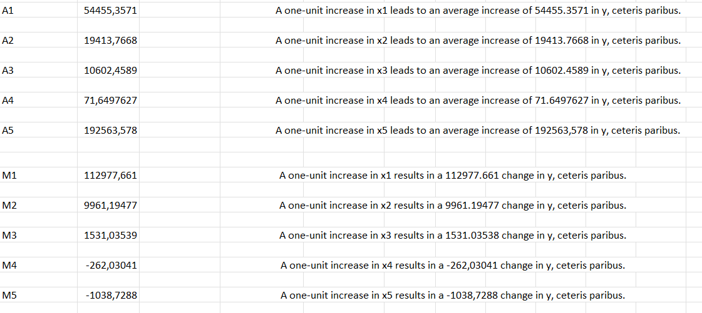  
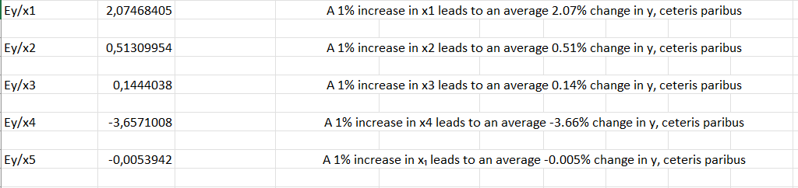  

For full calculations and explanations, you can view the Excel file [here](https://docs.google.com/spreadsheets/d/1OaJqY2DnaUXbAG8LgE8UehULJPl0767p/edit?usp=sharing&ouid=110802897082007095447&rtpof=true&sd=true).  

## SQL Analysis

### What is the average apartment price in Ukraine?
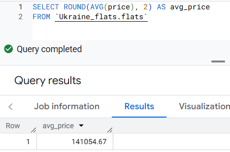
### What is the average price per square meter in the country?
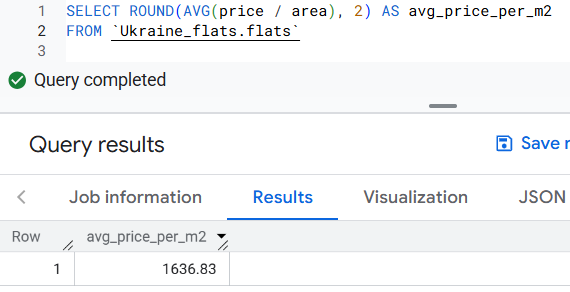
### Which are the top 5 cities with the most expensive apartments by average price?
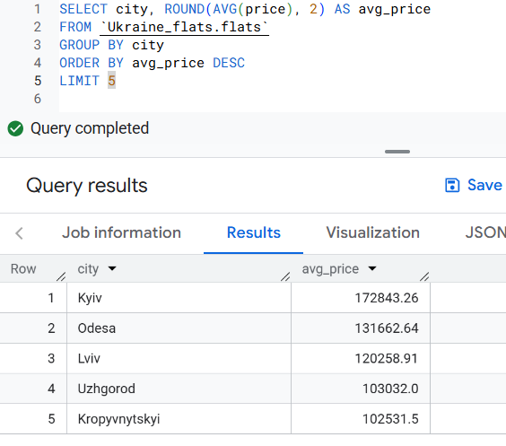
### What is the average price of apartments with different number of rooms?
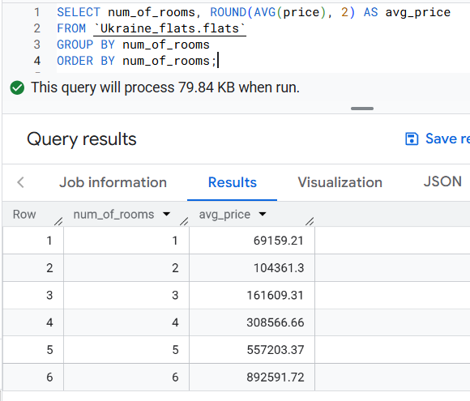
### Which apartments are more expensive: those in low-rise buildings (≤5 floors) or high-rise buildings (≥10 floors)?
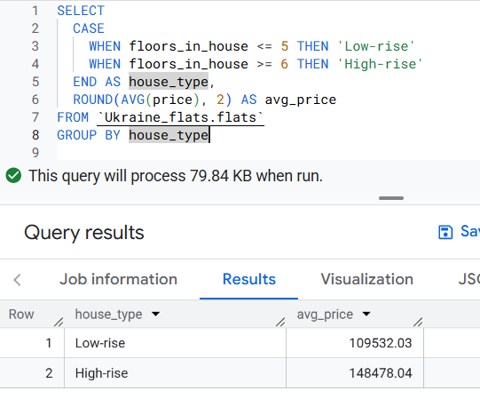
### What are the top 10 most expensive apartments (by price)?
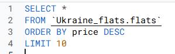
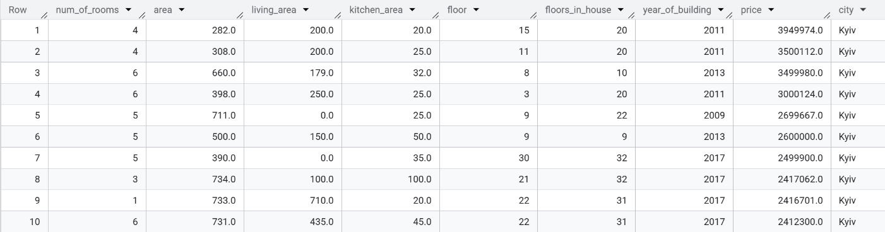
### Which region has the highest average price per square meter?
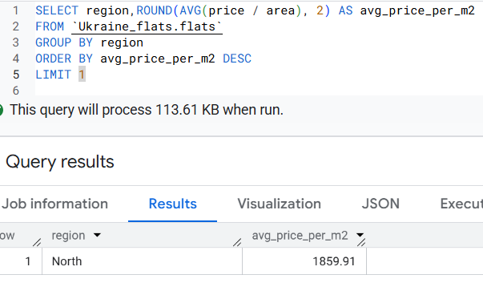


# Installation & Setup
1. Clone this repository:
   ```bash
   git clone https://github.com/YESosnovska/apartaments-prices-analysis.git
   cd apartments-prices-analysis
   ```
2. Create a virtual environment (optional but recommended):
    ```bash
   python -m venv venv
   source venv/bin/activate   # On Linux/Mac
   venv\Scripts\activate      # On Windows
    ```
3. Install dependencies:
   ```bash
   pip install -r requirements.txt
   ```
